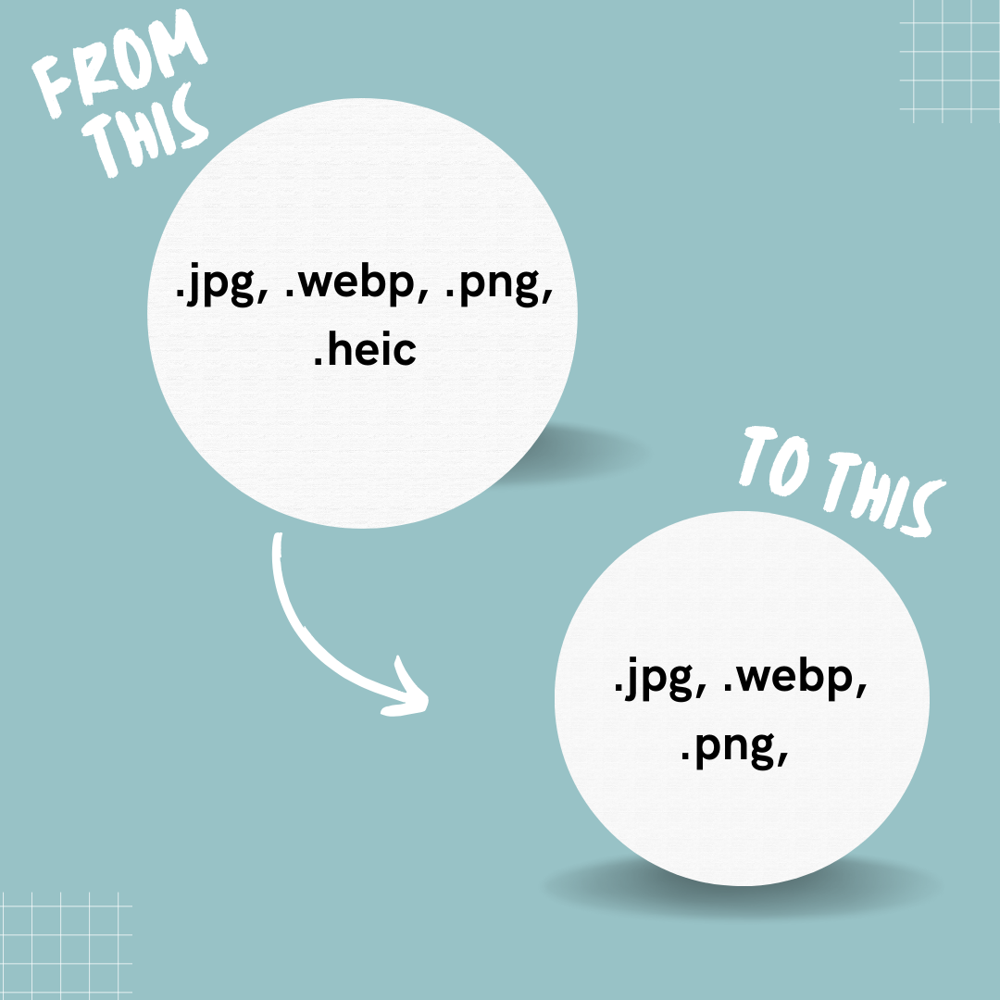

# 🖼️ Image Converter

## 📌 Overview
This Python script allows you to automatically convert images to another format.

## ✨ Features
- Converts images from **JPG, PNG, WEBP,** and **HEIC** formats.
- Saves images in **JPG, PNG,** and **WEBP** format .



## ⚙️ Requirements
Ensure you have Python installed, then install the necessary dependencies:

```sh
pip install -r requirements.txt
```

## 🚀 Usage
1. 📂 Place the images you want to convert in the `input_images` folder.
2. 🎯 Change the `OUTPUT_FORMAT` variable in `image_converter.py` to your desired format (`".png"`, `".jpg"` or `.webp`).
3. ▶️ Run the script:

```sh
python main.py
```

## 📜 License
This project is licensed under the MIT License. See the `LICENSE` file for details.


